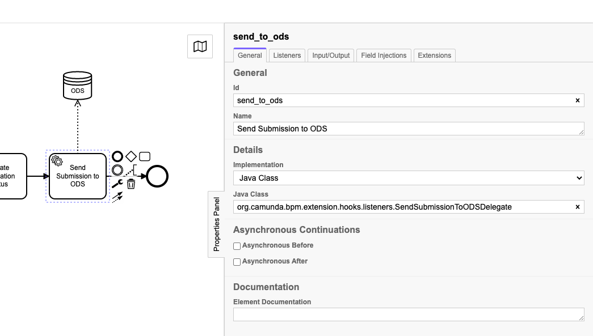
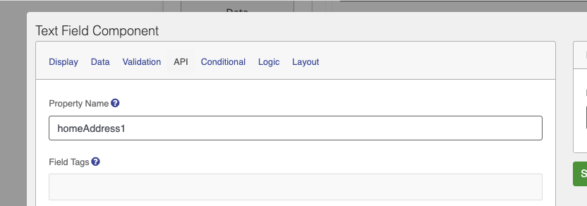

# Camunda 

This document contains information and HOWTOs on custom Camunda extensions made for use for the PSA Digital Journeys project. This includes things like how to send an email as part of a Camunda workflow, and how to push submissions to the ODS.

## Sending submission data to the Telus operational Data Store (ODS)

In order to support analytics of submission data for digital Journeys, submission data is pushed from the Formsflow application to the ODS. This can be added to a Camunda workflow by using the custom `SendSubmissionToODSDelegate`.

This will send the given form submission (based on the `formUrl` execution variable), to the given ODS endpoint, with the submittors IDIR and BCGov GUID added as properties.

### How?

1. Create a new Service Task in your workflow
2. Select `Java Class` as the "Implementation"
3. Set `Java Class` to `org.camunda.bpm.extension.hooks.listeners.SendSubmissionToODSDelegate`

4. Add an Input Parameter named `endpoint` in the `Input/Output` tab of the service task. Set the Variable Assignment Type to "String or Expression" and "Variable assignment Value" to the name of the endpoint you want to send the submission to. Example: In case of the telework form, this is `Datamart_Telework_app_telework_info`. The 

### Details

Names of the fields that are sent to the ODS are taken from the "Property Name" found on each component in the Form Builder as seen below. All form fields are sent to the ODS as is, with the exception of any file uploads, where the file content itself is replaced with the name of the file uploaded (comma separated in case of multiple files).

